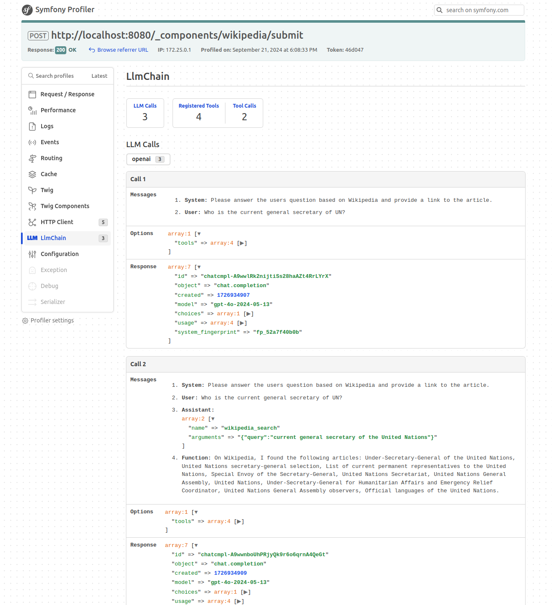

# LLM Chain Bundle

Symfony integration bundle for [php-llm/llm-chain](https://github.com/php-llm/llm-chain) library.

## Installation

```bash
composer require php-llm/llm-chain-bundle
```

## Configuration

```yaml
# config/packages/llm_chain.yaml
llm_chain:
    platforms:
        openai:
            api_key: '%env(OPENAI_API_KEY)%'
        azure:
            base_url: '%env(AZURE_OPENAI_BASEURL)%'
            deployment: '%env(AZURE_OPENAI_GPT)%'
            api_key: '%env(AZURE_OPENAI_KEY)%'
            version: '%env(AZURE_OPENAI_VERSION)%'
        anthropic:
            api_key: '%env(ANTHROPIC_API_KEY)%'
    chains:
        default:
            model:
                name: 'gpt'
                version: 'gpt-3.5-turbo'
                options: []
    stores:
        azure_search:
            api_key: '%env(AZURE_SEARCH_KEY)%'
            endpoint: '%env(AZURE_SEARCH_ENDPOINT)%'
            index_name: '%env(AZURE_SEARCH_INDEX)%'
            api_version: '2024-07-01'
        chroma_db:
            collection_name: '%env(CHROMA_COLLECTION)%'
        mongodb:
            database_name: '%env(MONGODB_DATABASE)%'
            collection_name: '%env(MONGODB_COLLECTION)%'
            index_name: '%env(MONGODB_INDEX)%'
            vector_field_name: 'vector'
            bulk_write: false
        pinecone:
            namespace: 'partition'
            filter: { 'key' : 'value' }
            top_k: 5
```

## Usage

### Chain Service

Use the `Chain` service to leverage GPT:
```php
use PhpLlm\LlmChain\ChainInterface;
use PhpLlm\LlmChain\Model\Message\Message;
use PhpLlm\LlmChain\Model\Message\MessageBag;

final readonly class MyService
{
    public function __construct(
        private ChainInterface $chain,
    ) {
    }
    
    public function submit(string $message): string
    {
        $messages = new MessageBag(
            Message::forSystem('Speak like a pirate.'),
            Message::ofUser($message),
        );

        return $this->chain->call($messages);
    }
}
```

### Register Tools

To use existing tools, you can register them as a service:
```yaml
services:
    _defaults:
        autowire: true
        autoconfigure: true

    PhpLlm\LlmChain\Chain\ToolBox\Tool\Clock: ~
    PhpLlm\LlmChain\Chain\ToolBox\Tool\OpenMeteo: ~
    PhpLlm\LlmChain\Chain\ToolBox\Tool\SerpApi:
        $apiKey: '%env(SERP_API_KEY)%'
    PhpLlm\LlmChain\Chain\ToolBox\Tool\SimilaritySearch: ~
    PhpLlm\LlmChain\Chain\ToolBox\Tool\Wikipedia: ~
    PhpLlm\LlmChain\Chain\ToolBox\Tool\YouTubeTranscriber: ~
```

Custom tools can be registered by using the `#[AsTool]` attribute:
```php
use PhpLlm\LlmChain\Chain\ToolBox\Attribute\AsTool;

#[AsTool('company_name', 'Provides the name of your company')]
final class CompanyName
{
    public function __invoke(): string
    {
        return 'ACME Corp.'
    }
}
```

### Profiler

The profiler panel provides insights into the chain's execution:


