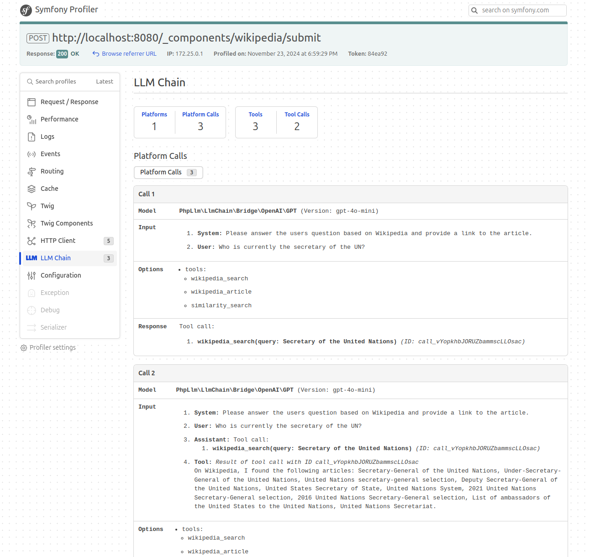

# LLM Chain Bundle

Symfony integration bundle for [php-llm/llm-chain](https://github.com/php-llm/llm-chain) library.

## Installation

```bash
composer require php-llm/llm-chain-bundle
```

## Configuration

```yaml
# config/packages/llm_chain.yaml
llm_chain:
    platforms:
        azure_gpt:
            type: 'azure'
            base_url: '%env(AZURE_OPENAI_BASEURL)%'
            deployment: '%env(AZURE_OPENAI_GPT)%'
            api_key: '%env(AZURE_OPENAI_KEY)%'
            version: '%env(AZURE_OPENAI_VERSION)%'
        azure_embeddings:
            type: 'azure'
            base_url: '%env(AZURE_OPENAI_BASEURL)%'
            deployment: '%env(AZURE_OPENAI_EMBEDDINGS)%'
            api_key: '%env(AZURE_OPENAI_KEY)%'
            version: '%env(AZURE_OPENAI_VERSION)%'
        openai:
            type: 'openai'
            api_key: '%env(OPENAI_API_KEY)%'
    llms:
        azure_gpt:
            platform: 'azure_gpt'
        original_gpt:
            platform: 'openai'
    embeddings:
        azure_embeddings:
            platform: 'azure_embeddings'
        original_embeddings:
            platform: 'openai'
    stores:
        chroma_db:
            engine: 'chroma-db'
            collection_name: '%env(CHROMA_COLLECTION)%'
        azure_search:
            engine: 'azure-search'
            api_key: '%env(AZURE_SEARCH_KEY)%' 
            endpoint: '%env(AZURE_SEARCH_ENDPOINT)%'
            index_name: '%env(AZURE_SEARCH_INDEX)%' 
            api_version: '2024-07-01'
```

## Usage

### Chain Service

Use the chain service to leverage GPT:
```php
use PhpLlm\LlmChain\Chat;

final readonly class MyService
{
    public function __construct(
        private Chain $chain,
    ) {
    }
    
    public function submit(string $message): string
    {
        $messages = new MessageBag();
        $messages[] = Message::forSystem('Speak like a pirate.');
        $messages[] = Message::ofUser($message);
        
        return $this->chain->call($messages);
    }
}
```

### Register Tools

To use existing tools, you can register them as a service:
```yaml
services:
    _defaults:
        autowire: true
        autoconfigure: true

    PhpLlm\LlmChain\ToolBox\Tool\Clock: ~
    PhpLlm\LlmChain\ToolBox\Tool\OpenMeteo: ~
    PhpLlm\LlmChain\ToolBox\Tool\SerpApi:
        $apiKey: '%env(SERP_API_KEY)%'
    PhpLlm\LlmChain\ToolBox\Tool\SimilaritySearch: ~
    PhpLlm\LlmChain\ToolBox\Tool\Wikipedia: ~
    PhpLlm\LlmChain\ToolBox\Tool\YouTubeTranscriber: ~
```

Custom tools can be registered by using the `#[AsTool]` attribute:
```php
use PhpLlm\LlmChain\ToolBox\AsTool;

#[AsTool('company_name', 'Provides the name of your company')]
final class CompanyName
{
    public function __invoke(): string
    {
        return 'ACME Corp.'
    }
}
```

### Profiler

The profiler panel provides insights into the chain's execution:


